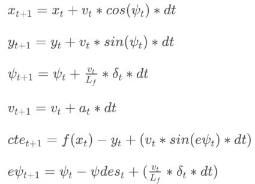

# CarND-Controls-MPC
Self-Driving Car Engineer Nanodegree Program

---

## Rubric Points

#### Describes the model in detail. This includes the state, actuators and update equations.

The model includes the x and y coordinates of the vehicle, orientation angle (psi), and velocity (v), cross-track error (cte) and psi error (epsi). Actuator outputs are throttle and steering angle. The model combines the state and actuations from the previous timestep to calculate the state for the current timestep based on the kinematic equations. These are the equations of motion:



#### Discuss the reasoning behind the chosen N (timestep length) and dt (elapsed duration between timesteps) values. Additionally describe the previous values tried.

The choice of N and dt are important to the performance of the MPC. If N is too small, the MPC will not be able to predict far enough into the future and will not predict an accurate current state and controls to prevent system overshoot or instabilities. However, a large N predicts unnecessary data for the future, thus increasing the computational cost.

A good dt value should be able to capture a system control response accurately. If dt is large, it will miss important control actions and the vehicle will be less responsive. If it is too small, it will respond in a very noisy fashion, fluctuating the controls faster than the car can respond.

The values if 10 and 0.1 were chosen for N and dt, respectively. This was a suggestion on Slack channel by some of the other students in the course. Changing these values created chaotic behaviour, such as: 25 / 0.01, 10 / 0.125, 4 / 0.15.

For the different values of N if the vehicle travels slower than 60 Mph, a smaller N of 6 works but is less responsive to significant system changes. A larger N above 18 woks better for different speed but has a huge computational cost.

It was found that due to the systems 100ms latency, a dt value smaller than this produced control instabilities, while larger that 100ms was found to be slow responding to the situation.

#### Describe any preprocesses done to the waypoints, the vehicle state, and/or actuators prior to the MPC procedure.

The waypoints were transformed to vehicle's orientation. This simplified the calcuation as the x, y, and psi are all zero. Also the vehicle's state was updated using the above aquations and latency as the time step.

#### Provide details on how you dealt with latency.

To account for latency, the vehicle's state after the latency was predicted using the kinematics equations and a time step of 100ms. This predicted state was then using in the MPC procedure. Also the cost functions for velocity resutled in much better performance.
## Dependencies

* cmake >= 3.5
 * All OSes: [click here for installation instructions](https://cmake.org/install/)
* make >= 4.1(mac, linux), 3.81(Windows)
  * Linux: make is installed by default on most Linux distros
  * Mac: [install Xcode command line tools to get make](https://developer.apple.com/xcode/features/)
  * Windows: [Click here for installation instructions](http://gnuwin32.sourceforge.net/packages/make.htm)
* gcc/g++ >= 5.4
  * Linux: gcc / g++ is installed by default on most Linux distros
  * Mac: same deal as make - [install Xcode command line tools]((https://developer.apple.com/xcode/features/)
  * Windows: recommend using [MinGW](http://www.mingw.org/)
* [uWebSockets](https://github.com/uWebSockets/uWebSockets)
  * Run either `install-mac.sh` or `install-ubuntu.sh`.
  * If you install from source, checkout to commit `e94b6e1`, i.e.
    ```
    git clone https://github.com/uWebSockets/uWebSockets
    cd uWebSockets
    git checkout e94b6e1
    ```
    Some function signatures have changed in v0.14.x. See [this PR](https://github.com/udacity/CarND-MPC-Project/pull/3) for more details.

* **Ipopt and CppAD:** Please refer to [this document](https://github.com/udacity/CarND-MPC-Project/blob/master/install_Ipopt_CppAD.md) for installation instructions.
* [Eigen](http://eigen.tuxfamily.org/index.php?title=Main_Page). This is already part of the repo so you shouldn't have to worry about it.
* Simulator. You can download these from the [releases tab](https://github.com/udacity/self-driving-car-sim/releases).
* Not a dependency but read the [DATA.md](./DATA.md) for a description of the data sent back from the simulator.


## Basic Build Instructions

1. Clone this repo.
2. Make a build directory: `mkdir build && cd build`
3. Compile: `cmake .. && make`
4. Run it: `./mpc`.
